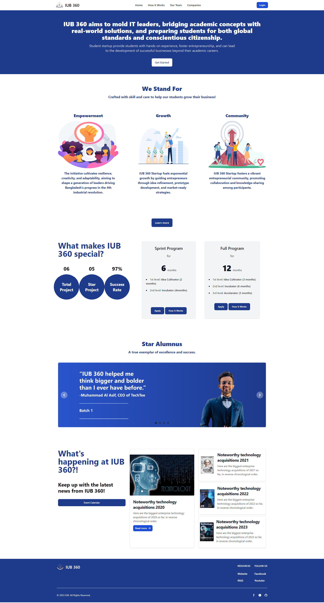
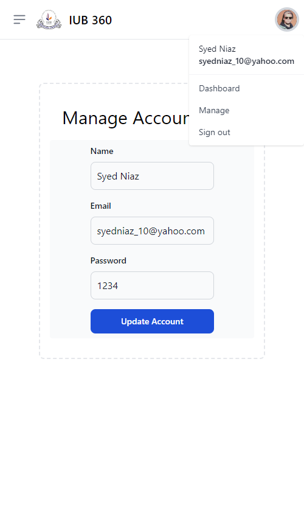
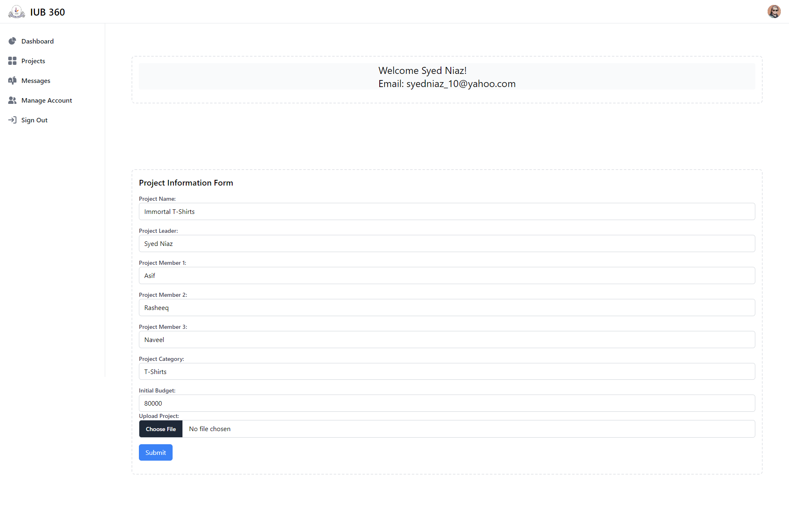
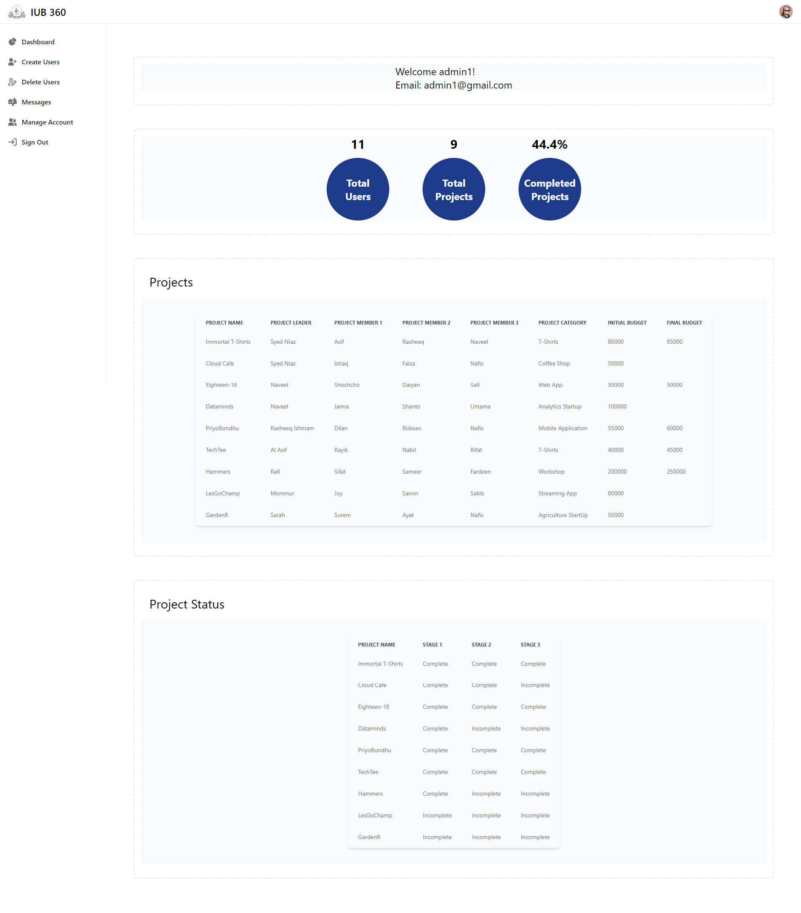

# IUB360
IUB360 Startup Program is a comprehensive initiative designed to take participants through the complete cycle of startup development, from concept to market entry.
It has been developed for our Web Applications course (CSE309) using HTML, CSS (Tailwind and Flowbite) supported by PHP for the backend and MySQL for the database.

https://github.com/syedniaz/iub360/assets/98218195/33ffed9e-9e20-4d53-bbcf-5f456cf608eb

# Screenshots

| Home Page                                                                                             | Responsive Design                                                                                     | 
| ----------------------------------------------------------------------------------------------------- | ----------------------------------------------------------------------------------------------------- |
|                 |          |

## Dashboard

| Student                                                                                               | Admin                                                                                                 | Mentor                                                                                              |
| ----------------------------------------------------------------------------------------------------- | ----------------------------------------------------------------------------------------------------- | --------------------------------------------------------------------------------------------------- |
|                     |                       |                   |

## How to run
1.  Install XAMPP.
2.  Go To htdocs folder inside c:\xampp.
3.  Clone the project inside htdocs directory inside xampp using git clone https://github.com/syedniaz/iub360.git .
4.  Import database using iub360.sql.
5.  Open localhost/iub360.
6.  Done!

